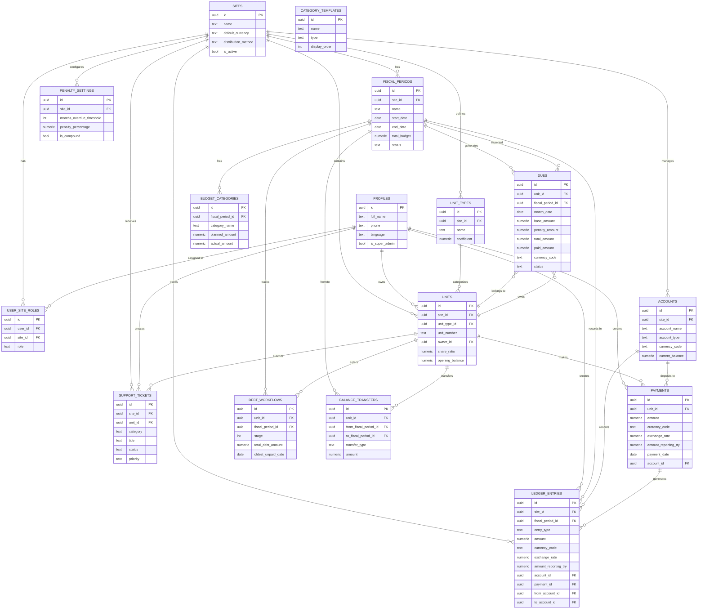
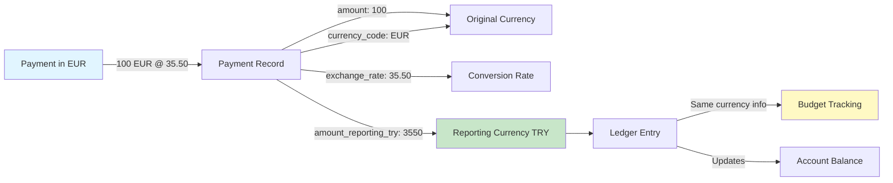
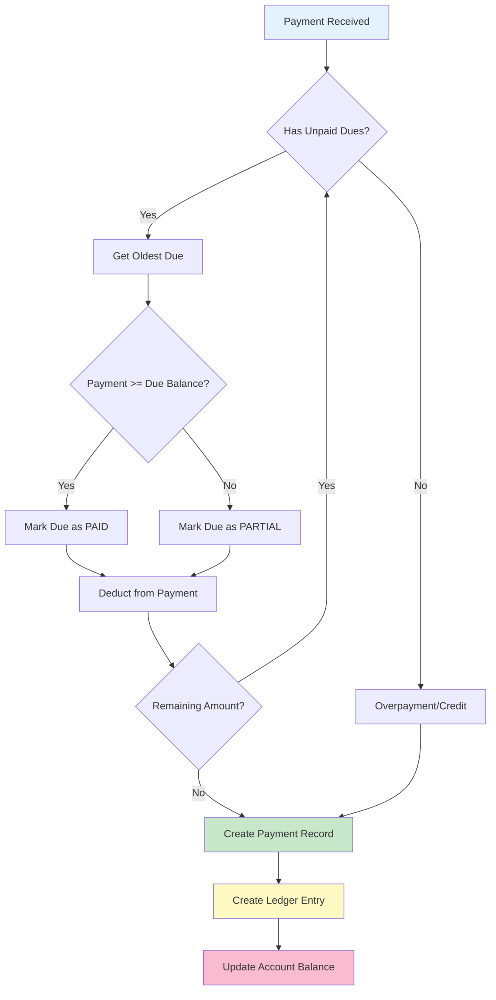
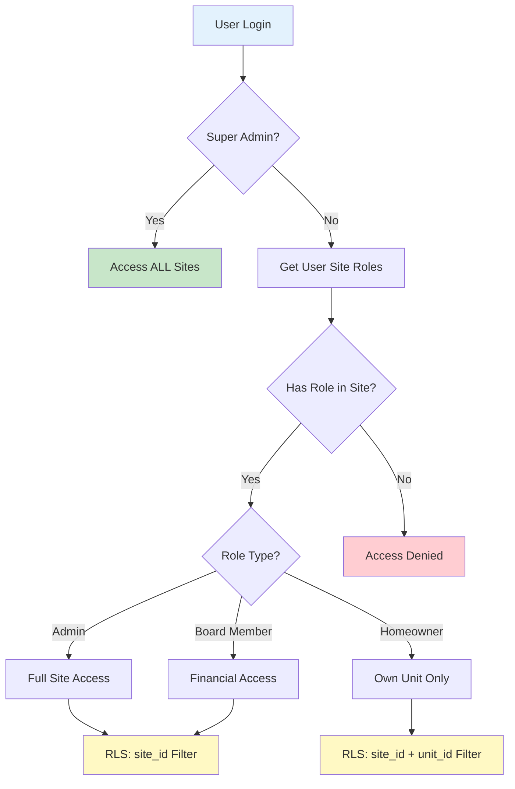
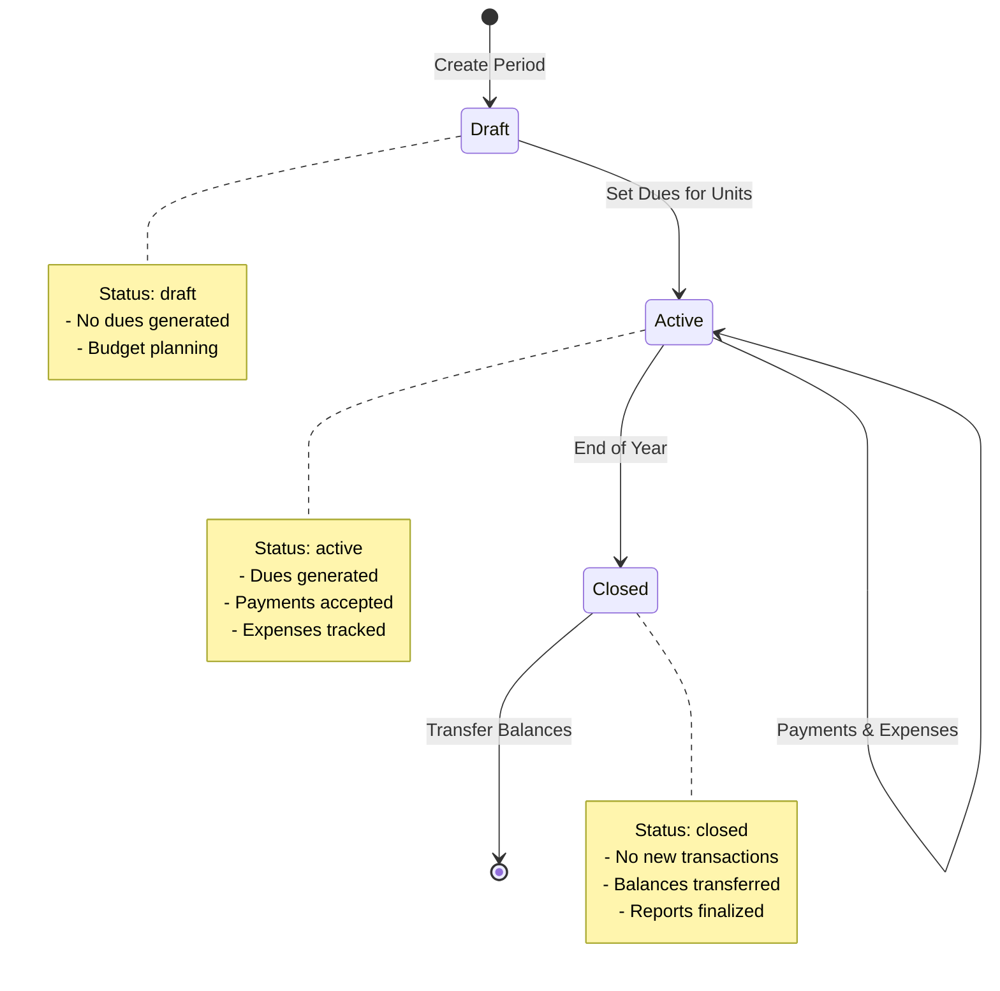
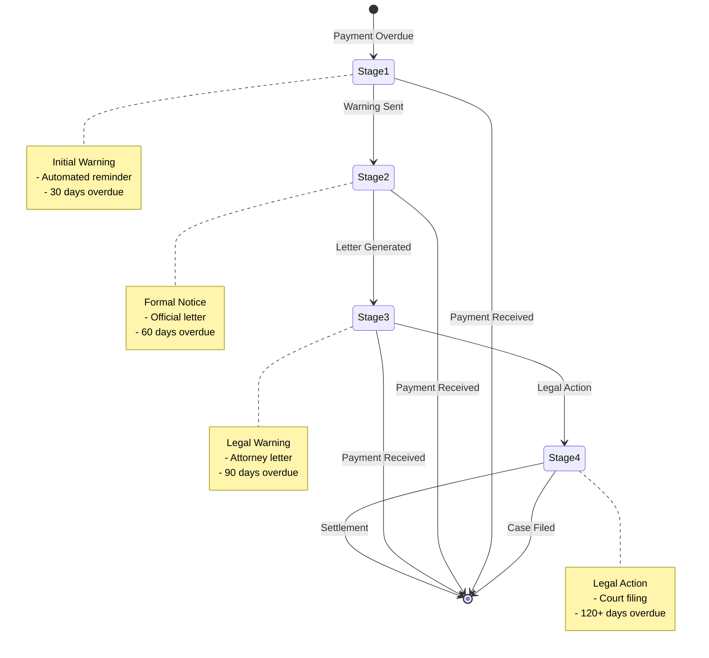
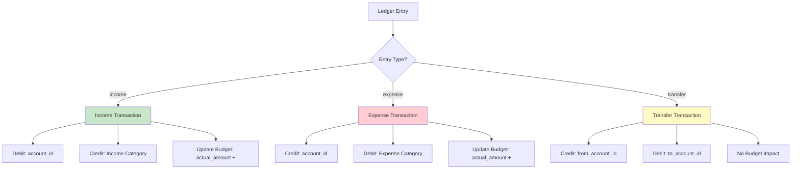

# Entity Relationship Diagram

## HOA Management System - Database Schema

### Core Entities Relationship

---

## Multi-Currency Data Flow

---

## Payment Application Flow (FIFO)

---

## Multi-Tenancy Security Model

---

## Fiscal Period Lifecycle

---

## Debt Collection Workflow

---

## Transaction Type Handling

---

## Key Insights

### 1. Multi-Tenancy Structure
- **Root Entity:** `sites` table
- **Access Control:** Via `user_site_roles` junction table
- **Data Isolation:** All operational tables linked to `site_id`

### 2. Financial Tracking
- **3-Column Pattern:** amount, currency_code, exchange_rate, amount_reporting_try
- **Double-Entry:** Maintained via triggers and constraints
- **Audit Trail:** All transactions in `ledger_entries`

### 3. Payment Processing
- **FIFO Application:** Oldest dues paid first
- **Automatic Ledger:** Payments create income entries
- **Currency Conversion:** Handled at payment time

### 4. Security Model
- **RLS Enabled:** All tables protected
- **Role-Based:** Admin, Board Member, Homeowner
- **Super Admin:** Optional global access

### 5. Fiscal Management
- **Annual Cycles:** 12-month fiscal periods
- **Budget Tracking:** Real-time actual vs planned
- **Period Closure:** Balance carryover to next period

---

## Database Statistics

| Metric | Value |
|--------|-------|
| Total Tables | 16 |
| Total Views | 5 |
| Total Functions | 4 |
| Total Migrations | 50 |
| Foreign Keys | 35+ |
| Indexes | 20+ |
| RLS Policies | 30+ |

---

## Performance Considerations

### Optimized Queries:
- ✅ Site-based filtering (indexed)
- ✅ Unit lookups (indexed)
- ✅ Date range queries (indexed)
- ✅ Status filtering (indexed)

### Potential Bottlenecks:
- 🟡 Large ledger_entries table (use partitioning if > 1M rows)
- 🟡 Complex view calculations (consider materialized views)
- 🟡 Bulk payment processing (use batch functions)

### Recommended Monitoring:
- Query execution times
- Table sizes and growth
- Index usage statistics
- Connection pool utilization
